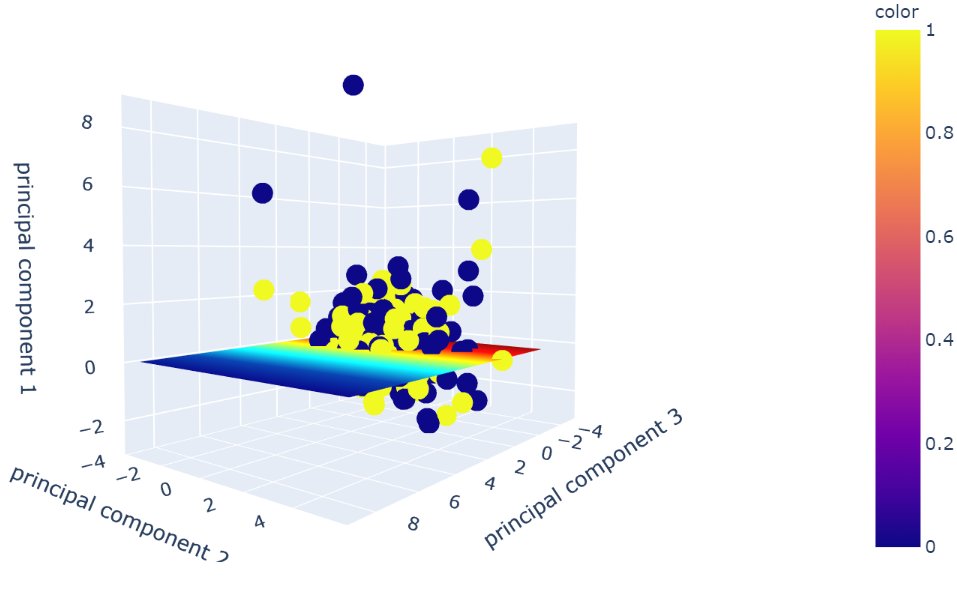

# Tesla: Choosing the Best Machince Learning Algorithm Model

## Group members:
- Shelly-Shaked Shtauber
- Juan Cajigas
- Aljohara Aloudan

## Core message:

Our goal of this project is finding which ML algorithm has the best forecasting accuracy score.  We ran several ML Algorithms both supervised and unsupervised and compared their performance. 

## Data Preparation:

We used Alpaca API to retrieve stock data of Tesla and TLT. We used closing prices and volume for both stocks and to better fit the ML algorithms, we calculated the daily returns for both features. 

The next step was to add a sentiment feature. In order ot achieve that we pulled news articles from Gnews and Stock News API. For each day, we selected articles within three days before and calculated the mean compound from all API sources. 

#### Final data frame:

## Features:
- Tesla price returns
- Tesla volume returns
- TLT price returns
- TLT volume returns
- Average of sentiments 

#### Correlation of the features presented by a heat map :

- We can see a postive correlation between daily returns tesla volume and daily returns TLT volume. 
- we can also observe a negative correlation between Tesla daily returns and TLT daily returns. 

## Target:
The target is 1 when the return of tesla for the next day is a positve value, and 0 when the return is negative. 

## Results of Machine Learning Algorithems:

### Supervised Learning:
- SVM 
                
                
    
    - PCA
        - In order to visualize the results, we used PCA to reduce the features to three 
        

- Decision Tree Classifier

- Random Forest Classifier 
  -   We ran Algorithm with a combination of a list of decisions several times with all the possible combinations of sets of parameters.
  

- LSTM Classifier

- Gradient Boosting Classifier
    - We used a set of parameteres to systimatically run all possible combinations in the model. To do so, we used Grid Search function that uses a dictionary to store all of the algorithms parmeters as the key, where the value is the list of ranges for each parametr.In this way, we can select an optimal values for the parameters to make sure that we explore all possibilites with regard to parameters setting. 
       

### Unsupervised Learning:
- K-nearest neighbors

- K=2 based on the fact that the biggest drop is from 1 to 2.

## Conclusion: 
KNN Classifier has the highest accuracy score at 0.57, whereas LSTM Classifier has the lowest accuracy score at 0.43.
We have listed all classifiers accuracy scores below:
- SVM accuracy socre: 0.55
- Desicion Tree classifier accuracy score: 0.50
- Random Forest Classifier accuracy score: 0.48
- Gradient Boosting Classifier accuracy score: 0.56
- LSTM Classifier accuracy score: 0.43
- KNN accuracy score: 0.57

